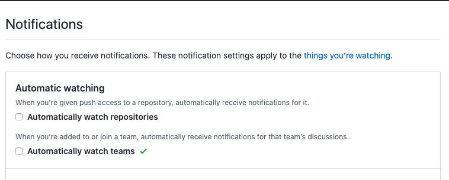

# keep-notif

> Organization に入ったときにすべてのリポジトリの通知が来るようになって通知欄がすごいことになって困ったひとが使うやつ。

- UnWatch all repositories in that Organization.
- If you want to make an appropriate restriction, change around `ret.filter`.

## get token

https://github.com/settings/tokens/new

Need `repo` and `notifications` scopes.

## run

```bash
$ npm i
$ export ORG_NAME=XXXXXXX
$ export GITHUB_PERSONAL_ACCESS_TOKEN=XXXXXXXXXXXXXXXXXXXXXXXXX
$ node index.js
```

## あの

あとから教えてもらったんですが、新しくORGに入る前にコイツラをOFFにすれば通知こないみたいです。チャンチャン。


